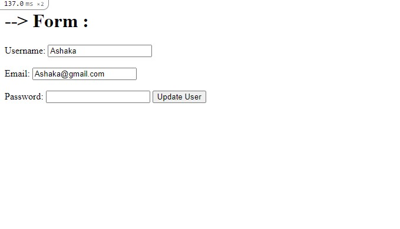

# Project: Bare Metal Forms and Helpers

This project is built on the fundamentals of creating a basic form that allows a create, edit and update method using rails. 



## Built-With

- Ruby -v  2.7.2
- Rails -v 6.0
- SQLite3
- VScode

### Prerequisites

To get this project up and running locally, you must already have ruby and necessary gems installed on your computer

**To get this project set up on your local machine, follow these simple steps:**

1. Open Terminal.
2. Navigate to your desired location to download the contents of this repository.
3. Copy and paste the following code into the Terminal: git clone ```git@github.com:AshakaE/re-former.git```
4. cd```re-former```.
5. Run ```bundle install``` to get the necesary gems.
6. Run `rails db:migrate`.
7. Run `rails server` and visit `http://localhost:3000/users/new ` to create a new user.


## Authors

👤 **Ashaka Egerega**

- Github: [@AshakaE](https://github.com/AshakaE)

👤 **Leandro Barreto**

- Github: [@Leandro-Barretoo](https://github.com/Leandro-Barretoo)


## Acknowledgment

The resources we have used to develop our project:

- [Odin-project](https://www.theodinproject.com/courses/ruby-on-rails/lessons/forms)
- [flash messages](https://medium.com/@nerdplusdog/back-in-a-flash-using-flash-messages-in-your-ruby-on-rails-apps-c39e09c15551)

## Show your support

Give ⭐ Star me on GitHub — it helps!

## 📝 License

This project is [MIT](lic.url) licensed.  

